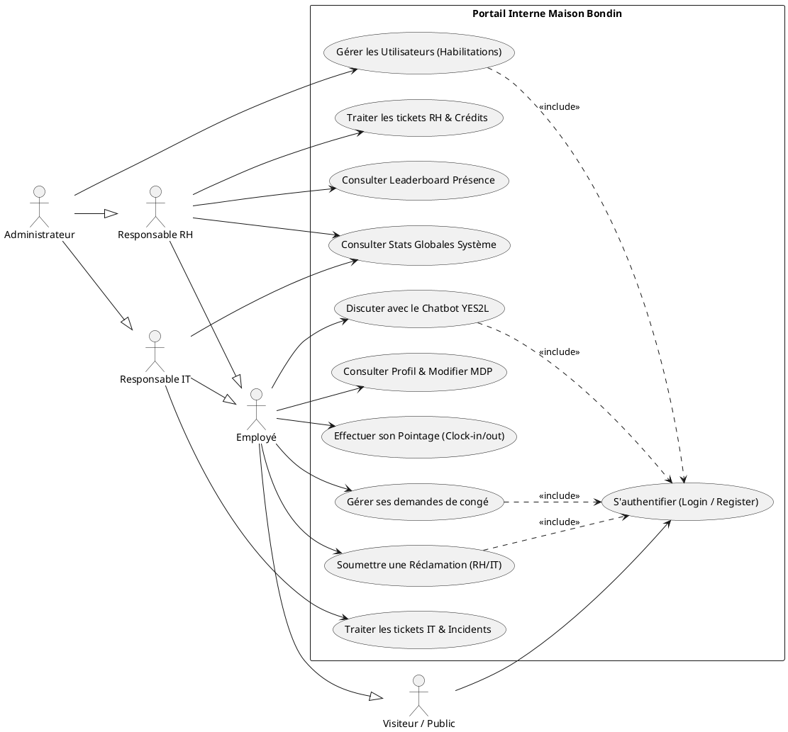
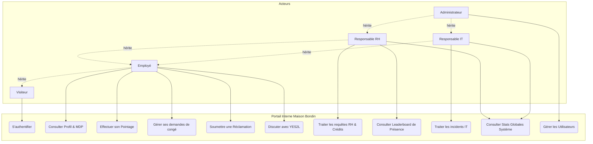
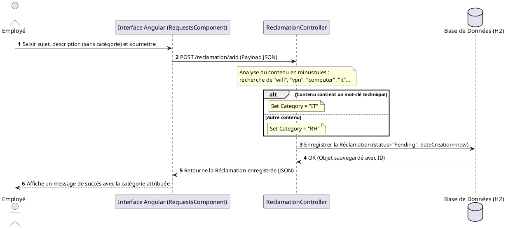
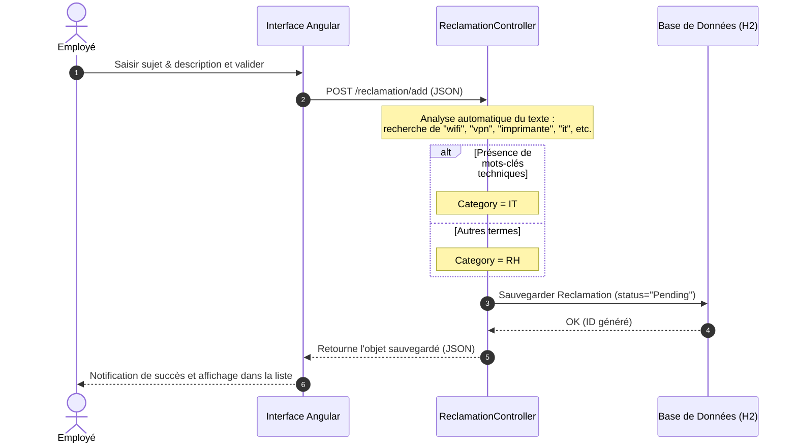
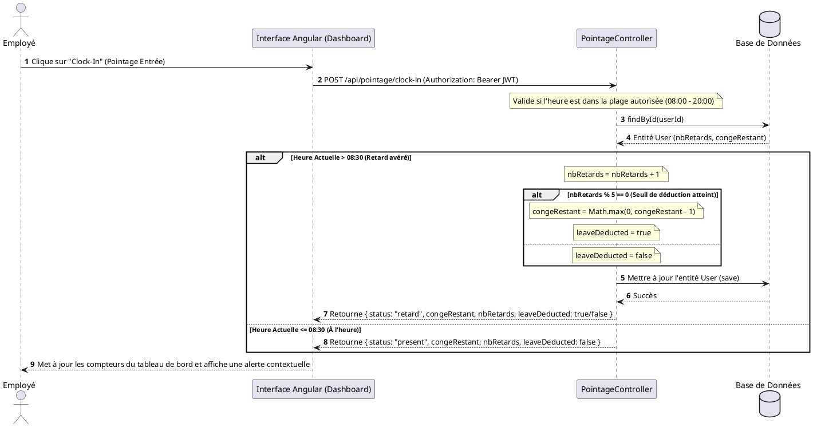
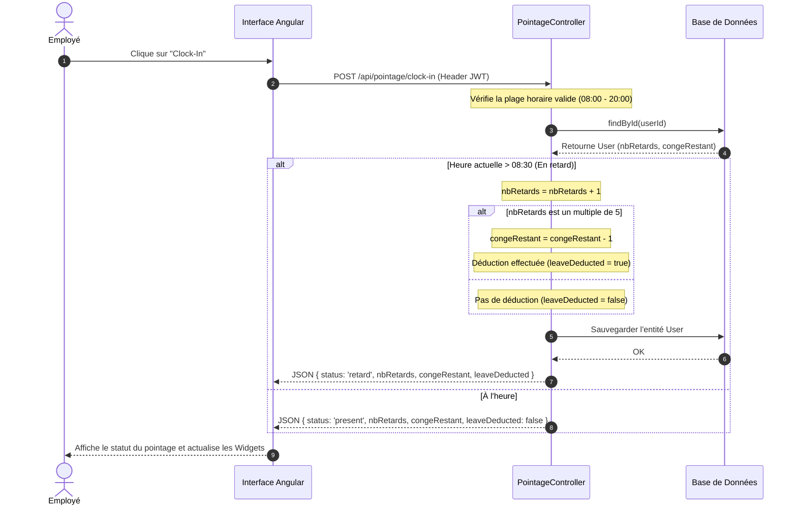
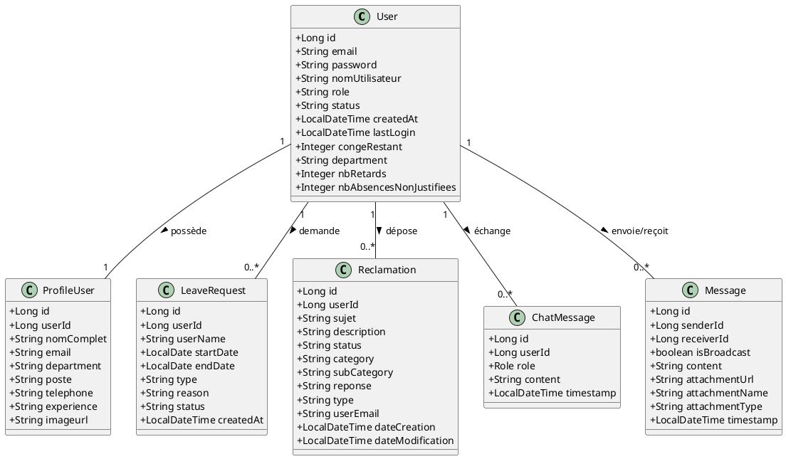
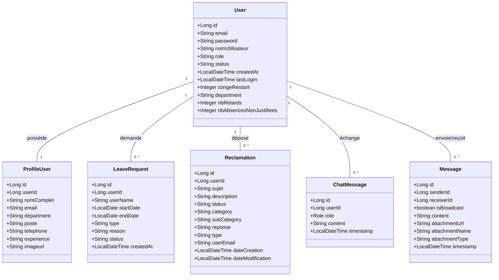

# Guide de Conception UML : Portail RH & IT Maison Bondin

Ce document est un guide d'ingénierie et de conception UML conçu spécifiquement pour le portail interne de la **Maison Bondin**. Il récapitule les acteurs du système, leurs rôles respectifs et fournit des spécifications de modélisation prêtes à l'emploi (aux formats **PlantUML** et **Mermaid**).

---

## 1. Analyse des Acteurs et Rôles

Le système repose sur quatre rôles d'utilisateurs authentifiés, un profil de visiteur et un agent intelligent (IA) de premier niveau.

### **A. Employé (Utilisateur Final)**
*   **Rôle :** Acteur principal qui interagit avec le portail pour son quotidien administratif et ses requêtes.
*   **Actions principales :**
    *   S'inscrire et se connecter à son espace personnel via authentification JWT.
    *   Consulter son profil de carrière, ses informations personnelles et mettre à jour ses coordonnées.
    *   Réaliser son **Pointage quotidien** (Clock-In / Clock-Out) entre 08:00 et 20:00.
    *   Suivre son solde de congés restants et soumettre des **Demandes de congé** (annuel, exceptionnel, maladie).
    *   Soumettre des **Réclamations** ou des **Questions** catégorisées, et joindre des justificatifs d'absence sous 48h.
    *   Interagir avec le chatbot intelligent **YES2L (Bondin Assistant)** pour des requêtes contextuelles (solde de congés, score de probabilité d'acceptation, calendrier de jours fériés).

### **B. Responsable RH (Rôle Métier)**
*   **Rôle :** Gère la gestion administrative, les effectifs et les congés de la Maison Bondin.
*   **Actions principales :**
    *   Visualiser, approuver ou refuser les demandes de congé soumises par les employés.
    *   Consulter et répondre aux requêtes de catégorie "RH" (ex: demandes de crédit, justificatifs d'absence).
    *   Consulter le tableau de bord RH contenant les charges de personnel et le **Leaderboard de présence** (Top 5 des retards et absences injustifiées).

### **C. Responsable IT (Rôle Technique)**
*   **Rôle :** Assure le support technique et la résolution des incidents technologiques internes.
*   **Actions principales :**
    *   Visualiser et traiter les réclamations de catégorie "IT" (problèmes de WiFi, VPN, matériel ou logiciels).
    *   Apporter des réponses de dépannage technique et clore les incidents résolus.
    *   Consulter le tableau de bord technique (statistiques globales de résolution des tickets).

### **D. Administrateur (Superviseur Système)**
*   **Rôle :** Supervision globale de l'intégrité opérationnelle de la plateforme (Règle métier : un seul administrateur autorisé dans le système).
*   **Actions principales :**
    *   Gérer les comptes utilisateurs (création, activation, révocation, modification de rôles).
    *   Visualiser tous les tickets de la plateforme (IT & RH) et l'intégralité des congés.
    *   Consulter les statistiques globales d'activité système.

### **E. Système / Chatbot YES2L (Acteur Secondaire / IA)**
*   **Rôle :** L'intelligence artificielle contextuelle (moteur Google Gemini) intégrée en temps réel.
*   **Fonctions automatisées :**
    *   Trier et catégoriser automatiquement les requêtes en "IT" ou "RH" lors de la soumission selon les mots-clés du contenu.
    *   Fournir des réponses et des simulations personnalisées basées sur le contexte utilisateur réel (sans jamais inventer de données).
    *   Stocker l'historique d'échange sécurisé (limité aux 60 derniers messages pour optimiser la mémoire).

---

## 2. Diagrammes de Cas d'Utilisation (Use Case)

### Version A : PlantUML (Pour outils traditionnels)

### Version B : Mermaid (Rendu natif en Markdown)

---

## 3. Diagrammes de Séquence (Flux Réels du Projet)

### Flux 1 : Soumission d'une Réclamation avec Catégorisation Automatique

Ce flux montre comment l'application catégorise automatiquement un ticket selon des mots-clés si aucune catégorie n'est choisie par l'utilisateur.

#### Option A : Code PlantUML

#### Option B : Code Mermaid

---

### Flux 2 : Processus de Pointage et Sanction Automatique de Retard

Ce flux modélise l'algorithme critique du projet : si un employé effectue son pointage d'entrée après 08h30, le système incrémente son compteur de retards. Tous les 5 retards, un jour de congé annuel est déduit de son solde.

#### Option A : Code PlantUML

#### Option B : Code Mermaid

---

## 4. Diagramme de Classes (Entités Core Réelles)

Ce diagramme montre les classes réelles implémentées dans le backend Java avec leurs attributs exacts et types correspondants.

### Version A : Code PlantUML

### Version B : Code Mermaid

---

> [!TIP]
> **Comment compiler ces diagrammes en images ?**
> 
> * **Pour PlantUML** :
>   1. Installez l'extension **PlantUML** dans VS Code.
>   2. Installez **Graphviz** sur votre système d'exploitation si nécessaire pour les rendus complexes.
>   3. Appuyez sur `Alt + D` dans votre éditeur pour prévisualiser le diagramme actif en temps réel.
> 
> * **Pour Mermaid** :
>   1. Installez l'extension **Markdown Preview Mermaid Support** dans VS Code.
>   2. Ouvrez l'aperçu standard du fichier Markdown (`Ctrl + Shift + V`), les graphiques se dessineront automatiquement en couleur.
>   3. Vous pouvez également copier le code et le coller dans [Mermaid Live Editor](https://mermaid.live/) pour l'exporter en PNG/SVG.
> 
> * **Export en PDF** :
>   Faites un clic droit sur ce fichier ouvert dans VS Code et sélectionnez **Markdown PDF: Export (pdf)** pour générer votre document de stage formaté de façon professionnelle.

---
*Document technique validé pour la plateforme de communication et de gestion RH de la Maison Bondin — Promotion Mai 2026.*
